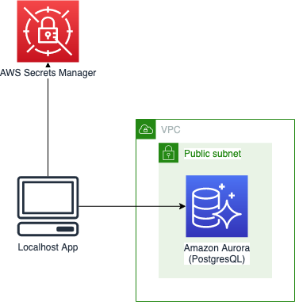

# AWS X-Ray Tutorial

This repository is for tutorial of using X-RAY using RDS and Secrets Manager on local machine.

We are going to run *app.py* on localhost to run some CRUD operations on RDS and 

**Running this repository may cost your AWS Account.**

# Prerequisites

- Docker 19+
- awscli
- Python 3.8
- Nodejs 12
- AWS Account and Locally configured AWS credential

# Installation

Deploying CDK provisions below infrastructure on your AWS account



## Provision Infrastructure

Install project dependencies

```bash
$ cd infra
$ npm i
```

Install cdk in global context and run `cdk init` if you did not initailize cdk yet.

```bash
$ npm i -g cdk@1.132.0
$ cdk init
$ cdk bootstrap
```

Replace allowing *ingressCIDR* with your public CIDR block at [**bin/infra.ts**](bin/infra.ts)

```typescript
const app = new cdk.App({
  context: {
    ns,
    ingressCIDR: '211.193.59.247/32', <-- replace it.
  },
});
```

Deploy infrastructure using CDK on AWS

```bash
$ cdk deploy "*" --require-approval never
```

## Setup Python App

Install dependencies

```bash
$ cd src
$ pip install -r requirements.txt
```

# Usage

1. Visit *[**AWS Console CloudFormation**](https://console.aws.amazon.com/cloudformation/home) > RdsStackDemo > Outputs*
, and copy *SecretArnDemo* value.

2. Run AWS X-ray on localhost using Docker

```bash
$ docker run \
      --rm \
      --attach STDOUT \
      -v ~/.aws/:/root/.aws/:ro \
      --name xray-daemon \
      -p 2000:2000/udp \
      amazon/aws-xray-daemon -o -n ap-northeast-2
```

3. Run App

```bash
$ gunicorn src.app:api -b 0.0.0.0:8080
[2020-05-10 16:01:29 +0900] [67049] [INFO] Starting gunicorn 20.0.4
[2020-05-10 16:01:29 +0900] [67049] [INFO] Listening at: http://0.0.0.0:8080 (67049)
[2020-05-10 16:01:29 +0900] [67049] [INFO] Using worker: sync
[2020-05-10 16:01:29 +0900] [67068] [INFO] Booting worker with pid: 67068
INFO:botocore.credentials:Found credentials in shared credentials file: ~/.aws/credentials
```